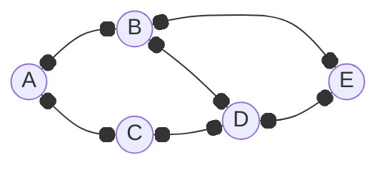

# Beginning - Data Structures and Algorithms

## 陣列 (Array)

訪問元素:

```rs
fn main() {
    let sentence = "The quick brown fox jumps over the lazy dog.";

    if let Some(c) = sentence.chars().nth(4) {
        println!("{c}"); // q
    }
}
```

```rs
fn main() {
    let sentence = "The quick brown fox jumps over the lazy dog.";
    println!("{}", &sentence[4..=4]); // q
}
```

```rs
fn main() {
    let sentence = "The quick brown fox jumps over the lazy dog.";
    println!("{}", sentence.as_bytes()[4] as char); // q
}
```

```rs
fn main() {
    let sentence = "The quick brown fox jumps over the lazy dog.";
    let chars: Vec<char> = sentence.chars().collect();
    println!("{}", chars[4]); // q
}
```

```rs
fn main() {
    let rainbow = [
        "Red", "Orange", "Yellow", "Green", "Blue", "Indigo", "Violet",
    ];

    println!("{}", rainbow[0]); // Red
    println!("{}", rainbow[3]); // Green
    println!("{}", rainbow[4]); // Blue
}
```

```rs
fn main() {
    let rainbow = vec![
        "Red", "Orange", "Yellow", "Green", "Blue", "Indigo", "Violet",
    ];

    println!("{}", rainbow[0]); // Red
    println!("{}", rainbow[3]); // Green
    println!("{}", rainbow[4]); // Blue
}
```

```rs
fn main() {
    let rainbow = vec![
        "Red", "Orange", "Yellow", "Green", "Blue", "Indigo", "Violet",
    ];

    println!("{:?}", rainbow.get(0)); // Some("Red")
    println!("{:?}", rainbow.get(3)); // Some("Green")
    println!("{:?}", rainbow.get(4)); // Some("Blue")
}
```

初始化陣列:

```rs
fn main() {
    let arr = [0; 10];
    println!("{arr:?}");

    let arr = [0; 10].to_vec();
    println!("{arr:?}");

    let arr = Vec::from([0; 10]);
    println!("{arr:?}");

    let arr = vec![0; 10];
    println!("{arr:?}");

    let arr: [i32; 10] = vec![0; 10].try_into().unwrap();
    println!("{arr:?}");

    let arr: Vec<i32> = (0..10).map(|_| 0).collect();
    println!("{arr:?}");

    let arr: [i32; 10] = std::array::from_fn(|_| 0);
    println!("{arr:?}");
}
// 皆輸出: [0, 0, 0, 0, 0, 0, 0, 0, 0, 0]
```

插入元素:

```rs
fn main() {
    let mut arr = vec!["A", "B", "C", "D", "E"];
    arr.insert(3, "Z"); // 在索引 3 處插入 Z
    println!("{arr:?}");

    let mut arr = vec!["A", "B", "C", "D", "E"];
    arr.splice(3..3, vec!["Z"]); // 在索引 3 處插入 Z，可插入多個元素
    println!("{arr:?}");
}
// 皆輸出: ["A", "B", "C", "Z", "D", "E"]
```

```rs
fn main() {
    let mut arr = vec!["A", "B", "C", "D", "E"];

    // 找到 C 的索引位置
    if let Some(index) = arr.iter().position(|&x| x == "C") {
        // 插入 Z 到 C 之後的位置
        arr.insert(index + 1, "Z");
    }

    println!("{arr:?}"); // ["A", "B", "C", "Z", "D", "E"]
}
```

刪除元素:

```rs
fn main() {
    let mut arr = vec!["A", "B", "C", "D", "E"];

    if let Some(index) = arr.iter().position(|&x| x == "C") {
        arr.remove(index); // 根據索引移除元素，只會移除第一個出現的
    }

    println!("{arr:?}"); // ["A", "B", "D", "E"]
}
```

```rs
fn main() {
    let mut arr = vec!["A", "B", "C", "D", "E"];
    arr.retain(|&x| x != "C"); // 保留陣列中符合條件的元素，也就是刪除不符合條件的元素。
    println!("{arr:?}"); // ["A", "B", "D", "E"]
}
```

```rs
fn main() {
    let arr = vec!["A", "B", "C", "D", "E"];
    // 不修改原始陣列，而是建一個新陣列
    let filtered: Vec<_> = arr.into_iter().filter(|&x| x != "C").collect();
    println!("{filtered:?}", ); // ["A", "B", "D", "E"]
}
```

### 雙指標 (Two Pointers)

相關名詞:

- 弗洛伊德判圈演算法 (Floyd’s Cycle Detection Algorithm)
- 龜兔賽跑演算法 (Tortoise and Hare Algorithm)
- 快慢指標 (Fast and Slow Pointers)

移動數字 0 至末尾:

```rs
fn main() {
    let mut nums = vec![0, 1, 0, 3, 12];

    let mut left = 0; // 左指標，指向下次應該交換的非零元素位置
    let mut right = 0; // 右指標，走訪整個陣列

    while right < nums.len() {
        // 如果右指標指向的數字不是 0
        if nums[right] != 0 {
            nums.swap(left, right); // 交換左指標和右指標的數字
            left += 1; // 左指標移動到下一個位置
        }

        right += 1; // 右指標繼續向右移動
    }

    println!("{nums:?}");
    // [1, 3, 12, 0, 0]
}
```

## 鏈結串列 (Linked List)

### 單向鏈結串列 (Singly Linked List)

Rust 不允許「遞迴型別」沒有間接層 (indirection)，因為編譯器不知道 `ListNode` 的大小是多少 (它裡面又包含另一個 `ListNode`，無限展開)，所以需使用 `Box<ListNode>`:

- `Box<T>` 是一個固定大小的「指標」
- 指向堆積 (Heap) 上真實儲存的 `T`

```rs
#[derive(PartialEq, Eq, Clone, Debug)]
pub struct ListNode<T> {
    pub value: T,
    pub next: Option<Box<ListNode<T>>>,
}

impl<T> ListNode<T> {
    #[inline]
    pub fn new(value: T) -> Self {
        ListNode { value, next: None }
    }
}
```

```rs
fn main() {
    let mut head = None;

    for value in ["E", "D", "C", "B", "A"] {
        head = Some(Box::new(ListNode { value, next: head }));
    }

    let mut current = head.as_ref();

    while let Some(node) = current {
        print!("{}", node.value);

        if node.next.is_some() {
            print!(" -> ");
        }

        current = node.next.as_ref();
    }

    println!();
}
// A -> B -> C -> D -> E
```

#### 雙指標 (Two Pointers)

找出鏈結串列的中間節點:

- 慢指標每次移動一步
- 快指標每次移動兩步

```rs

```

### 雙向鏈結串列 (Doubly Linked List)

```rs
use std::collections::LinkedList;

fn main() {
    // 建立一個空的 LinkedList
    let mut list: LinkedList<String> = LinkedList::new();

    // 插入元素
    list.push_back("A".into());
    list.push_back("B".into());
    list.push_back("C".into());
    list.push_front("D".into());

    // 打印整個 LinkedList
    println!("List: {list:?}"); // List: ["D", "A", "B", "C"]

    // 查看頭尾元素
    println!("Front: {:?}", list.front()); // Front: Some("D")
    println!("Back: {:?}", list.back()); // Back: Some("C")

    // 移除元素
    list.pop_front();
    list.pop_back();

    // 打印移除元素後的整個 LinkedList
    println!("After pop: {list:?}"); // After pop: ["A", "B"]

    let mut list2: LinkedList<String> = LinkedList::new();
    list2.push_back("E".into());
    list2.push_back("F".into());

    list.append(&mut list2);

    // 打印附加 list2 後的整個 LinkedList
    println!("After append: {list:?}"); // After append: ["A", "B", "E", "F"]
}
```

## 堆疊 (Stack)

以後進先出 (Last In, First Out，LIFO) 為原則。

```rs
#[derive(Debug)]
pub struct Stack<T> {
    items: Vec<T>,
}

impl<T> Stack<T> {
    pub fn new() -> Self {
        Stack { items: Vec::new() }
    }

    // 將元素加入堆疊
    pub fn push(&mut self, item: T) {
        self.items.push(item);
    }

    // 移除並返回堆疊頂部的元素
    pub fn pop(&mut self) -> Option<T> {
        self.items.pop()
    }

    // 查看堆疊頂部的元素
    pub fn peek(&self) -> Option<&T> {
        self.items.last()
    }

    // 檢查堆疊是否為空
    pub fn is_empty(&self) -> bool {
        self.items.is_empty()
    }

    // 返回堆疊中的元素數量
    pub fn size(&self) -> usize {
        self.items.len()
    }

    // 清空堆疊
    pub fn clear(&mut self) {
        self.items.clear();
    }
}
```

```rs
fn main() {
    let mut stack = Stack::new();
    stack.push(10);
    stack.push(20);
    stack.push(30);
    println!("{:?}", stack.peek()); // Some(30)
    println!("{:?}", stack.pop()); // Some(30)
    println!("{:?}", stack.size()); // 2
    println!("{:?}", stack.is_empty()); // false
    stack.clear();
    println!("{:?}", stack.is_empty()); // true
}
```

基於鏈結串列 (Linked List) 實現:

```rs

```

## 佇列 (Queue)

以先進先出 (First In First Out，FIFO) 為原則。

```rs
use std::collections::VecDeque;

fn main() {
    let mut queue = VecDeque::new();

    // 入列
    queue.push_back("A");
    queue.push_back("B");
    queue.push_back("C");

    // 處理最先入列的資料
    while let Some(front) = queue.pop_front() {
        println!("Processing: {front}");
    }
}
// Processing: A
// Processing: B
// Processing: C
```

### 滑動視窗 (Sliding Window)

```rs
use std::collections::VecDeque;

fn main() {
    // 宣告容量為 3 的 VecDeque 作為滑動視窗
    let mut sliding_window = VecDeque::with_capacity(3);

    // 模擬資料流的輸入
    let stream_data = vec![1, 2, 3, 4, 5];

    for data in stream_data {
        // 保持視窗的大小，超過容量時移除最舊的數據
        if sliding_window.len() == sliding_window.capacity() {
            sliding_window.pop_front();
        }

        // 新資料推入視窗
        sliding_window.push_back(data);

        // 此時可以使用滑動視窗進行一些操作
        println!("當前滑動視窗: {sliding_window:?}");
    }
}
// 當前滑動視窗: [1]
// 當前滑動視窗: [1, 2]
// 當前滑動視窗: [1, 2, 3]
// 當前滑動視窗: [2, 3, 4]
// 當前滑動視窗: [3, 4, 5]
```

加上操作:

```rs
use std::collections::VecDeque;

fn main() {
    // 宣告容量為 3 的 VecDeque 作為滑動視窗
    let mut sliding_window = VecDeque::with_capacity(3);

    // 模擬資料流的輸入
    let stream_data = vec![1, 2, 3, 4, 5];

    // 宣告用來追蹤滑動視窗元素總和的變數
    let mut window_sum = 0;

    for data in stream_data {
        // 保持視窗的大小，超過容量時移除最舊的數據
        if sliding_window.len() == sliding_window.capacity() {
            if let Some(removed) = sliding_window.pop_front() {
                window_sum -= removed; // 從總和中扣掉被移除的數字
            }
        }

        // 新資料推入視窗
        sliding_window.push_back(data);

        // 此時可以使用滑動視窗進行一些操作
        window_sum += data; // 將新資料加到總和裡
        println!("當前滑動視窗: {sliding_window:?}, 總和: {window_sum}");
    }
}
// 當前滑動視窗: [1], 總和: 1
// 當前滑動視窗: [1, 2], 總和: 3
// 當前滑動視窗: [1, 2, 3], 總和: 6
// 當前滑動視窗: [2, 3, 4], 總和: 9
// 當前滑動視窗: [3, 4, 5], 總和: 12
```

## 雜湊表 (Hash Table)

```rs
use std::collections::HashMap;

fn main() {
    let mut scores = HashMap::new();

    scores.insert("Alice", 60);
    scores.insert("Bob", 70);
    scores.insert("Carol", 90);

    if let Some(score) = scores.get("Alice") {
        println!("查詢 Alice 的分數: {score}");
        // 查詢 Alice 的分數: 60
    }

    // 更新值
    scores.insert("Alice", 65);

    println!("分數表數量: {}", scores.len()); // 分數表數量: 3

    // 列出 HashMap 中的所有鍵值組
    for (key, value) in &scores {
        println!("{key} 的分數: {value}");
    }
}
```

```rs
use std::collections::HashSet;
```

```rs
use hashbrown::{HashMap, HashSet};
```

## 二元樹 (Binary Tree)

```rs
use std::cell::RefCell;
use std::rc::Rc;

#[derive(Debug, PartialEq, Eq)]
pub struct TreeNode<T> {
    pub value: T,
    pub left: Option<Rc<RefCell<TreeNode<T>>>>,
    pub right: Option<Rc<RefCell<TreeNode<T>>>>,
}

impl<T> TreeNode<T> {
    #[inline]
    pub fn new(value: T) -> Self {
        TreeNode {
            value,
            left: None,
            right: None,
        }
    }
}
```

```rs
fn main() {
    let level1_root = Rc::new(RefCell::new(TreeNode::new(1)));
    let level2_left = Rc::new(RefCell::new(TreeNode::new(2)));
    let level2_right = Rc::new(RefCell::new(TreeNode::new(3)));
    let level3_left_left = Rc::new(RefCell::new(TreeNode::new(4)));
    let level3_left_right = Rc::new(RefCell::new(TreeNode::new(5)));

    level1_root.borrow_mut().left = Some(Rc::clone(&level2_left));
    level1_root.borrow_mut().right = Some(Rc::clone(&level2_right));
    level2_left.borrow_mut().left = Some(Rc::clone(&level3_left_left));
    level2_left.borrow_mut().right = Some(Rc::clone(&level3_left_right));

    println!("{level1_root:#?}");
}
//     1
//    / \
//   2   3
//  / \
// 4   5
```

```rs
impl<T> TreeNode<T> {
    #[inline]
    pub fn new(value: T) -> Rc<RefCell<Self>> {
        Rc::new(RefCell::new(TreeNode {
            value,
            left: None,
            right: None,
        }))
    }
}
```

```rs
fn main() {
    let level1_root = TreeNode::new(1);
    let level2_left = TreeNode::new(2);
    let level2_right = TreeNode::new(3);
    let level3_left_left = TreeNode::new(4);
    let level3_left_right = TreeNode::new(5);

    level1_root.borrow_mut().left = Some(level2_left.clone());
    level1_root.borrow_mut().right = Some(level2_right.clone());
    level2_left.borrow_mut().left = Some(level3_left_left.clone());
    level2_left.borrow_mut().right = Some(level3_left_right.clone());

    println!("{level1_root:#?}");
}
//     1
//    / \
//   2   3
//  / \
// 4   5
```

走訪節點 (層序走訪 (Level-order Traversal), 廣度優先搜尋 (Breadth-First Search, BFS)):

```rs

```

### 前序走訪

以遞迴方式依序走訪「根節點 -> 左子樹 -> 右子樹」。

```rs

```

比對兩棵樹是否為相同:

```rs
use std::cell::RefCell;
use std::rc::Rc;

#[derive(Debug, PartialEq, Eq)]
pub struct TreeNode<T> {
    pub value: T,
    pub left: Option<Rc<RefCell<TreeNode<T>>>>,
    pub right: Option<Rc<RefCell<TreeNode<T>>>>,
}

impl<T> TreeNode<T> {
    #[inline]
    pub fn new(value: T) -> Rc<RefCell<Self>> {
        Rc::new(RefCell::new(TreeNode {
            value,
            left: None,
            right: None,
        }))
    }
}

pub fn is_same_tree<T: PartialEq>(
    p: Option<Rc<RefCell<TreeNode<T>>>>,
    q: Option<Rc<RefCell<TreeNode<T>>>>,
) -> bool {
    match (p, q) {
        (None, None) => true, // 如果兩棵樹都是空的，它們相等
        (Some(p_node), Some(q_node)) => {
            // 如果當前節點的值相等，遞迴比對左子樹和右子樹
            p_node.borrow().value == q_node.borrow().value
                && is_same_tree(p_node.borrow().left.clone(), q_node.borrow().left.clone())
                && is_same_tree(p_node.borrow().right.clone(), q_node.borrow().right.clone())
        }
        _ => false, // 其他情況 (如一者為 None，另一者不是)，它們不相等
    }
}

fn main() {
    let tree1_level1_root = TreeNode::new(1);
    let tree1_level2_left = TreeNode::new(2);
    let tree1_level2_right = TreeNode::new(3);
    tree1_level1_root.borrow_mut().left = Some(tree1_level2_left);
    tree1_level1_root.borrow_mut().right = Some(tree1_level2_right);

    let tree2_level1_root = TreeNode::new(1);
    let tree2_level2_left = TreeNode::new(2);
    let tree2_level2_right = TreeNode::new(3);
    tree2_level1_root.borrow_mut().left = Some(tree2_level2_left);
    tree2_level1_root.borrow_mut().right = Some(tree2_level2_right);

    let tree1 = Some(tree1_level1_root.clone());
    let tree2 = Some(tree2_level1_root.clone());
    println!("{}", is_same_tree(tree1, tree2));
    // true

    let tree2_level2_right = TreeNode::new(4);
    tree2_level1_root.borrow_mut().right = Some(tree2_level2_right);
    let tree1 = Some(tree1_level1_root.clone());
    let tree2 = Some(tree2_level1_root.clone());
    println!("{}", is_same_tree(tree1, tree2));
    // false
}
```

### 中序走訪

```rs

```

### 後序走訪

```rs

```

## 二元搜尋樹 (Binary Search Tree)

搜尋節點:

```rs

```

插入節點:

```rs

```

刪除節點:

```rs

```

## 平衡樹 (Balanced Tree, AVL / Red-Black Tree)

```rs
use std::cell::RefCell;
use std::rc::Rc;

#[derive(Debug, PartialEq, Eq)]
pub enum NodeColor {
    Red,
    Black,
}

#[derive(Debug, PartialEq, Eq)]
pub struct TreeNode<T: Ord> {
    pub value: T,                                // 節點的值
    pub height: u32,                             // 高度 (用於 AVL 樹的平衡計算)
    pub color: Option<NodeColor>,                // 可選的顏色標記 (用於紅黑樹)
    pub left: Option<Rc<RefCell<TreeNode<T>>>>,  // 左子樹
    pub right: Option<Rc<RefCell<TreeNode<T>>>>, // 右子樹
}

// 實作 TreeNode 的範例初始化方法
impl<T: Ord> TreeNode<T> {
    pub fn new(value: T) -> Rc<RefCell<Self>> {
        Rc::new(RefCell::new(TreeNode {
            value,
            height: 1, // 初始高度設定為 1
            color: None,
            left: None,
            right: None,
        }))
    }
}
```

## 堆積 (Heap)

### 大頂堆積 (Max Heap)

```rs
use std::collections::BinaryHeap;

fn main() {
    let mut max_heap = BinaryHeap::new();

    // 元素入堆積
    max_heap.extend(vec![1, 3, 6, 5, 9, 8, 15]);

    // 取得堆積頂元素
    if let Some(max_el) = max_heap.peek() {
        println!("堆積頂元素: {max_el}"); // 15
    }

    // 頂元素出堆積
    println!("{}", max_heap.pop().unwrap()); // 15
    println!("{}", max_heap.pop().unwrap()); // 9
    println!("{}", max_heap.pop().unwrap()); // 8

    // 取得堆積長度
    println!("堆積長度: {}", max_heap.len()); // 4

    // 判斷堆積是否為空
    println!("堆積是否為空: {}", max_heap.is_empty()); // false

    // 清空堆積
    max_heap.drain();
    println!("堆積是否為空: {}", max_heap.is_empty()); // true
}
```

插入元素:

```rs
let mut max_heap = BinaryHeap::new();
max_heap.push(3);
max_heap.push(5);
max_heap.push(1);
max_heap.push(8);
```

從陣列建立:

```rs
let data = vec![3, 5, 1, 8];
let mut max_heap = BinaryHeap::from(data);
```

依序出堆積:

```rs
while let Some(max_el) = max_heap.pop() {
    println!("{max_el}");
}
```

### 小頂堆積 (Min Heap)

```rs
use std::cmp::Reverse;
use std::collections::BinaryHeap;

fn main() {
    let mut min_heap = BinaryHeap::new();

    let data = vec![1, 3, 6, 5, 9, 8, 15];
    min_heap.extend(data.into_iter().map(Reverse));

    while let Some(Reverse(min_el)) = min_heap.pop() {
        println!("{min_el}");
    }
}
```

## 字典樹 (Trie)

`children`，例如插入 "apple":

```
a → p → p → l → e
```

`is_end_of_word`，例如插入 "app" 和 "apple":

```
a - p - p (is_end_of_word = true)
         \
          l - e (is_end_of_word = true)
```

```rs
use std::collections::HashMap;

#[derive(Default)]
struct TrieNode {
    children: HashMap<char, TrieNode>,
    is_end_of_word: bool,
}

impl TrieNode {
    fn new() -> Self {
        Default::default()
    }
}

struct Trie {
    root: TrieNode,
}

impl Trie {
    fn new() -> Self {
        Trie {
            root: TrieNode::new(),
        }
    }

    fn insert(&mut self, word: String) {
        let mut node = &mut self.root;

        for char in word.chars() {
            node = node.children.entry(char).or_insert(TrieNode::new());
        }

        node.is_end_of_word = true;
    }

    fn search(&self, word: String) -> bool {
        let mut node = &self.root;

        for char in word.chars() {
            match node.children.get(&char) {
                Some(next) => node = next,
                None => return false,
            }
        }

        node.is_end_of_word
    }

    fn starts_with(&self, prefix: String) -> bool {
        let mut node = &self.root;

        for char in prefix.chars() {
            match node.children.get(&char) {
                Some(next) => node = next,
                None => return false,
            }
        }

        true
    }
}
```

```rs
fn main() {
    let mut trie = Trie::new();

    trie.insert("apple".into());
    println!("{}", trie.search("apple".into())); // true
    println!("{}", trie.search("app".into())); // false
    println!("{}", trie.starts_with("app".into())); // true

    trie.insert("app".into());
    println!("{}", trie.search("app".into())); // true
}
```

## 圖 (Graph)

鄰接表 (Adjacency List) 的雜湊表方式:

由頂點 (Vertex) -> 邊 (Edge) 組成:

```
A → B, C
B → A, D, E
C → A, D
D → B, C, E
E → B, D
```



```rs
use std::collections::HashMap;

#[derive(Debug)]
struct Graph {
    adj: HashMap<String, Vec<String>>,
}

impl Graph {
    fn new() -> Self {
        Self {
            adj: HashMap::new(),
        }
    }

    fn add_vertex(&mut self, val: &str) {
        self.adj.entry(val.to_string()).or_insert(vec![]);
    }

    fn add_edge(&mut self, from: &str, to: &str) {
        self.adj
            .entry(from.to_string())
            .or_insert(vec![])
            .push(to.to_string());
    }

    fn neighbors(&self, val: &str) -> Option<&Vec<String>> {
        self.adj.get(val)
    }
}

fn main() {
    let mut g = Graph::new();

    // 加入頂點
    for v in ["A", "B", "C", "D", "E"] {
        g.add_vertex(v);
    }

    // 加入邊
    g.add_edge("A", "B");
    g.add_edge("A", "C");

    g.add_edge("B", "A");
    g.add_edge("B", "D");
    g.add_edge("B", "E");

    g.add_edge("C", "A");
    g.add_edge("C", "D");

    g.add_edge("D", "B");
    g.add_edge("D", "C");
    g.add_edge("D", "E");

    g.add_edge("E", "B");
    g.add_edge("E", "D");

    println!("A: {:?}", g.neighbors("A").unwrap());
    println!("B: {:?}", g.neighbors("B").unwrap());
    println!("C: {:?}", g.neighbors("C").unwrap());
    println!("D: {:?}", g.neighbors("D").unwrap());
    println!("E: {:?}", g.neighbors("E").unwrap());
}
// A: ["B", "C"]
// B: ["A", "D", "E"]
// C: ["A", "D"]
// D: ["B", "C", "E"]
// E: ["B", "D"]
```

## 排序 (Sorting)

### 冒泡排序 (Bubble Sort)

反覆對相鄰元素進行比較與交換，讓最大的元素每一趟都往序列的一端「冒泡」。

1. 從左到右，比較 `arr[j]` 與 `arr[j+1]`
2. 若前者大於後者則交換
3. 完成一趟後，最大值位於末端；下一趟可少比較一個末端位置 (最大泡泡浮出水面)
4. 若某一趟中沒有任何交換，序列已排序，可提早結束

```rs
pub fn bubble_sort<T: Ord>(arr: &mut [T]) {
    let n = arr.len();

    if n <= 1 {
        return;
    }

    for i in 0..n {
        let mut swapped = false;

        // 每一趟把最大值冒到末端，末端區域不再比較
        for j in 0..(n - 1 - i) {
            if arr[j] > arr[j + 1] {
                arr.swap(j, j + 1);
                swapped = true;
            }
        }

        // 若本趟未發生交換，提早結束
        if !swapped {
            break;
        }
    }
}
```

```rs
fn main() {
    let mut arr = vec![5, 3, 8, 4, 2];
    bubble_sort(&mut arr);
    println!("{arr:?}");
    // [2, 3, 4, 5, 8]
}
```

### 選擇排序 (Selection Sort)

每次從未排序的部分中選出最小的元素，並將其放到已排序部分的最後。

### 堆積排序 (Heap Sort)

### 合併排序 (Merge Sort)

基於分治 (Divide and Conquer) 策略。

## 搜尋 (Searching)

### 雙閉區間 `[left, right]` 的二分搜尋 (Binary Search)

```rs
fn binary_search(arr: &Vec<i32>, target: i32) -> Option<usize> {
    let mut left = 0;
    let mut right = arr.len().saturating_sub(1); // 雙閉區間，右邊界包含最後一個元素

    while left <= right {
        let mid = left + (right - left) / 2; // 避免溢位

        if arr[mid] == target {
            return Some(mid);
        } else if arr[mid] < target {
            left = mid + 1; // 搜尋右半邊
        } else {
            right = mid.saturating_sub(1); // 搜尋左半邊
        }
    }

    None // 找不到
}

fn main() {
    let arr = vec![1, 3, 5, 7, 9];
    let target = 7;

    if let Some(index) = binary_search(&arr, target) {
        println!("找到 {target}，位置在 {index}");
    } else {
        println!("{target} 不存在於陣列中");
    }
}
// 找到 7，位置在 3
```

## 分治 (Divide and Conquer)

分治法策略:

1. 分解 (Divide): 把問題拆成較小的子問題
2. 解決 (Conquer): 遞迴地解決這些子問題
3. 合併 (Combine): 把子問題的結果合併，得到最終答案

例子:

- 合併排序 (Merge Sort)
- 快速排序 (Quick Sort)
- 二分搜尋 (Binary Search)
- 矩陣乘法（Strassen 演算法）

## 回溯 (Backtracking)

回溯法策略:

1. 狀態 (State): 目前的解或部分解
2. 嘗試 (Try / Choice): 針對下一步的可行選擇
3. 回退 (Backtrack): 嘗試之後，還原狀態，以便探索其他選擇
4. 紀錄解 (Record / Solution): 當達到目標條件時，保存結果
5. 剪枝 (Pruning): 提前排除不可能的路徑，提高效率

全排列:

```rs
fn main() {
    let permutation_length = 3; // 每個排列要有幾個元素
    let max_number = 3; // 可選數字的最大值

    let mut current = Vec::new(); // 當前狀態
    let mut solutions = Vec::new(); // 紀錄解

    fn backtrack(
        current: &mut Vec<u32>,
        solutions: &mut Vec<Vec<u32>>,
        permutation_length: usize,
        max_number: u32,
    ) {
        // 達到目標長度，紀錄解
        if current.len() == permutation_length {
            solutions.push(current.clone());
            return;
        }

        // 嘗試每一個可能選擇
        for i in 1..=max_number {
            // 如果已經在 current 中，跳過 (剪枝)
            if current.contains(&i) {
                continue;
            }

            // 嘗試
            current.push(i);

            // 繼續探索下一個
            backtrack(current, solutions, permutation_length, max_number);

            // 回退
            current.pop();
        }
    }

    backtrack(&mut current, &mut solutions, permutation_length, max_number);

    println!("所有解: {solutions:?}");
    // 所有解: [[1, 2, 3], [1, 3, 2], [2, 1, 3], [2, 3, 1], [3, 1, 2], [3, 2, 1]]
}
```

## 動態規劃 (Dynamic Programming)

費波那契數:

```rs
fn fibonacci(n: usize) -> u64 {
    let mut dp = vec![0_u64, 1];

    for i in 2..=n {
        dp.push(dp[i - 1] + dp[i - 2]);
    }

    dp[n]
}

fn main() {
    println!("{}", fibonacci(10)); // 55
}
```

爬樓梯，爬到第 n 個階梯，每次爬 1 階或 2 階:

```
                    ___
                ___| n
            ___| 4
        ___| 3
    ___| 2
___| 1
 0
```

```rs
fn climb_stairs(n: usize) -> u64 {
    let mut dp = vec![1_u64, 2];

    for i in 2..=n {
        dp.push(dp[i - 1] + dp[i - 2]);
    }

    dp[n - 1]
}

fn main() {
    println!("{}", climb_stairs(4)); // 5
}
```

爬到第 4 階，共有 5 種方式:

```
0 -> 1 -> 2 -> 3 -> 4
0 -> 1 -> 2      -> 4
0 -> 1      -> 3 -> 4
0      -> 2 -> 3 -> 4
0      -> 2      -> 4
```

## 貪婪 (Greedy)

在問題的每個決策階段 都選擇當前看起來最優的選擇，以期望能得到全域的最優解。

### 分數背包問題 (Fractional Knapsack Problem)

給定一個背包，背包的容量是有限的，你可以選擇將物品裝入背包。每個物品有一個重量和價值，但你可以選擇將物品切割，部分裝入背包。目標是最大化裝入背包中的物品的總價值。

物品:

```rs
let items = vec![
    Item { weight: 1.0, value: 5.0 },
    Item { weight: 2.0, value: 11.0 },
    Item { weight: 3.0, value: 15.0 },
];
```

## 位元操作 (Bit Manipulation)

| 運算       | 說明                    | Rust     |
| ---------- | ----------------------- | -------- |
| AND 及     | 兩者都為 1 才為 1       | `a & b`  |
| OR 或      | 兩者只要一個為 1 就為 1 | `a \| b` |
| XOR 互斥或 | 不同為 1，相同為 0      | `a ^ b`  |
| NOT 反相   | 反轉位元                | `!a`     |
| 左移       | 相當於 ×2               | `a << n` |
| 右移       | 相當於 ÷2               | `a >> n` |

```rs
fn main() {
    let a = 5;  // 0101
    let b = 3;  // 0011

    println!("{}", a & b); // 1 (0001)
    println!("{}", a | b); // 7 (0111)
    println!("{}", a ^ b); // 6 (0110)
    println!("{}", a << 1); // 10
    println!("{}", a >> 1); // 2
}
```
