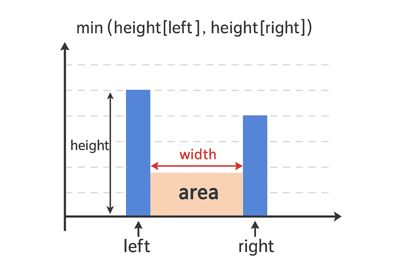

# 11. 裝最多水的容器 (Container With Most Water)

給定一個長度為 `n` 的整數陣列 `height`。繪製 `n` 條垂直線，第 `i` 條線的兩個端點為 `(i, 0)` 和 `(i, height[i])`。

找出其中的兩條線，使得它們與 x 軸共同構成的容器可以容納最多的水。

回傳容器可以儲存的最大水量。

**注意**，你不能傾斜容器。

範例 1：


```coffee
輸入: height = [1,8,6,2,5,4,8,3,7]
輸出: 49
說明: 圖中垂直線表示陣列 [1,8,6,2,5,4,8,3,7]。在此情況下，容器可容納的最大水面積 (藍色部分) 為 49。
```

範例 2：

```coffee
輸入: height = [1,1]
輸出: 1
```

## 解題



```coffee
藍色柱子: 表示 height[left] 和 height[right]
高度 (height): 取兩者的最小值 min(height[left], height[right])
寬度 (width): 兩指標之間的距離 (right - left)
面積 (area): height * width
```

```rs
impl Solution {
    pub fn max_area(height: Vec<i32>) -> i32 {
        // 初始化雙指標
        let mut left = 0;
        let mut right = height.len() - 1;

        let mut max_area = 0;

        // 當左指標小於右指標時，持續計算
        while left < right {
            // 計算當前高度、寬度和面積
            let current_height = height[left].min(height[right]);
            let current_width = (right - left) as i32;
            let current_area = current_height * current_width;

            // 更新最大面積
            if current_area > max_area {
                max_area = current_area;
            }

            // 移動指標，移動較短的那一邊
            if height[left] < height[right] {
                left += 1;
            } else {
                right -= 1;
            }
        }

        max_area
    }
}
```
